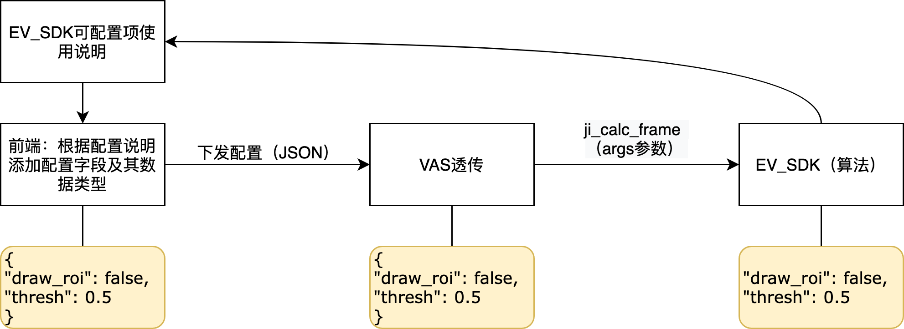

# EV_SDK配置协议

版本：1.0

此文档是EV_SDK可配置参数的实现协议说明，**EV_SDK的实现者**（算法开发者）和**EV_SDK使用者**（为EV_SDK生成配置参数）需要遵守此协议。

## 1. 目前SDK配置的使用方法

### 1.1 [EV_SDK3.0](http://git.extremevision.com.cn/algo_engine/ev_sdk)配置样例

```json
{
    "gpu_id": 0,
    "draw_roi_area": true,
    "roi_color": [255, 255, 0, 0.7],
    "roi": ["POLYGON((0.08 0.1,0.05 0.8,0.8 0.9,0.7 0.05,0.4 0.05))"],
    "roi_line_thickness": 4,
    "roi_fill": false,
    "draw_result": true,

    "warning_text_en": "WARNING! WARNING!"
}
```

### 1.2 数据解析流程




## 2. 协议

### 2.1 格式

配置格式必须遵守[JSON标准格式](http://json.cn/wiki.html)规范。

### 2.2 数据格式定义

- 只能存在一级**KEY-VALUE**变量定义；

- **VALUE**必须是2.3所定义的数据类型；

合法格式示例：

```json
{
  "key1": value1,
  "key2": value2
}
```

其中`value1`和`value2`必须是1.3所定义的数据类型。

不合法格式示例（假定`{"key2": value2}`不是2.3所定义的数据类型）：

```json
{
  "key1": {
    "key2": value2
  },
  "key3": value3
}
```

### 2.3 数据类型

- 所有**JSON**标准定义的非对象类型和非数组类型，如：`string`、`number`、`true`、`false`、`null`；

- 单个多边形类型：符合[WKT格式标准](https://en.wikipedia.org/wiki/Well-known_text_representation_of_geometry)的`POLYGON`字符串，示例：

  ```json
  {
    "roi": "POLYGON ((30 10, 40 40, 20 40, 10 20, 30 10))"
  }
  ```

- 单个线类型：符合[WKT格式标准](https://en.wikipedia.org/wiki/Well-known_text_representation_of_geometry)的`LINESTRING`字符串示例：

  ```json
  {
    "cross_line": "LINESTRING (30 10, 10 30, 40 40)"
  }
  ```

- 单个点类型：符合[WKT格式标准](https://en.wikipedia.org/wiki/Well-known_text_representation_of_geometry)的`POINT`字符串示例：

  ```json
  {
    "direction_point": "POINT (30 10)"
  }
  ```

- 多个多边形类型：符合[WKT格式标准](https://en.wikipedia.org/wiki/Well-known_text_representation_of_geometry)的`MULTIPOLYGON`字符串示例：

  ```json
  {
    "rois": "MULTIPOLYGON (((40 40, 20 45, 45 30, 40 40)), ((20 35, 10 30, 10 10, 30 5, 45 20, 20 35), (30 20, 20 15, 20 25, 30 20)))"
  }
  ```

- 多个线类型：符合[WKT格式标准](https://en.wikipedia.org/wiki/Well-known_text_representation_of_geometry)的`MULTILINESTRING`字符串示例：

  ```json
  {
    "cross_lines": "MULTILINESTRING ((10 10, 20 20, 10 40), (40 40, 30 30, 40 20, 30 10))"
  }
  ```

- 多个点类型：符合符合[WKT格式标准](https://en.wikipedia.org/wiki/Well-known_text_representation_of_geometry)的`MULTIPOINT`字符串示例：

  ```json
  {
    "points": "MULTIPOINT ((10 40), (40 30), (20 20), (30 10))"
  }
  ```

- 多个多边形类型2（用于兼容现有EV_SDK的实现）：由多个**单个多边形类型**构成的数组示例：

  ```json
  {
    "rois": ["POLYGON ((30 10, 40 40, 20 40, 10 20, 30 10))", "POLYGON ((30 10, 40 40, 20 40, 10 20, 30 10))"]
  }
  ```

- 多个线类型2（用于兼容现有EV_SDK的实现）：由多个**单个线类型**组成的数组示例：

  ```json
  {
    "cross_lines": ["LINESTRING (30 10, 10 30, 40 40)", "LINESTRING (30 10, 10 30, 40 40)"]
  }
  ```

- 多个点类型2（用于兼容现有EV_SDK的实现）：由多个**单个点类型**组成的数组示例：

  ```json
  {
    "direction_points": ["POINT (30 10)", "POINT (30 10)"]
  }
  ```


- BGRA颜色类型：BGRA四个数字表示的颜色类型：`[255, 255, 0, 0]`，其中前三个数字分别表示BGR三个颜色通道的值，范围：`[0, 255]`，第四个值表示透明度，范围`[0, 1]`，值越大越透明。

## 3. 注意事项

### 3.1 对于算法开发者

算法开发者在实现过程中，需要注意：

- 遵守以上所定义的协议；

- 对于与WKT格式相关的点、线、框参数，推荐直接使用原始的WKT协议，例如对于包含多个多边形的参数：

  - 推荐使用

    ```json
    "rois": "MULTIPOLYGON (((40 40, 20 45, 45 30, 40 40)), ((20 35, 10 30, 10 10, 30 5, 45 20, 20 35), (30 20, 20 15, 20 25, 30 20)))"
    ```

  - 而不是旧格式：

    ```json
    "rois": ["POLYGON ((30 10, 40 40, 20 40, 10 20, 30 10))", "POLYGON ((30 10, 40 40, 20 40, 10 20, 30 10))"]
    ```

- 协议提供了目前常用的数据类型，实现过程中可以按照需要使用**KEY**的名称做逻辑区分，例如需要使用多根线类型的情况：

  ```json
  {
    "start_line": "LINESTRING (10 20, 10 30, 40 140)",
    "end_line": "LINESTRING (10 5, 10 30, 40 140)"
  }
  ```

## 4. 扩展

如果协议所定义的数据类型无法满足需要，可以加入新的类型。协议加入新的类型后要求：

- 对于EV_SDK实现者，根据所需扩展类型按照新的协议进行实现，已实现旧协议的EV_SDK无需重新实现新扩展类型；
- 对于EV_SDK使用者，需要按照协议扩展，加入对新实现的类型的支持；

